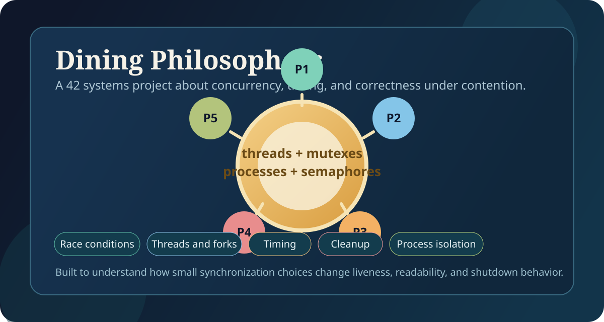
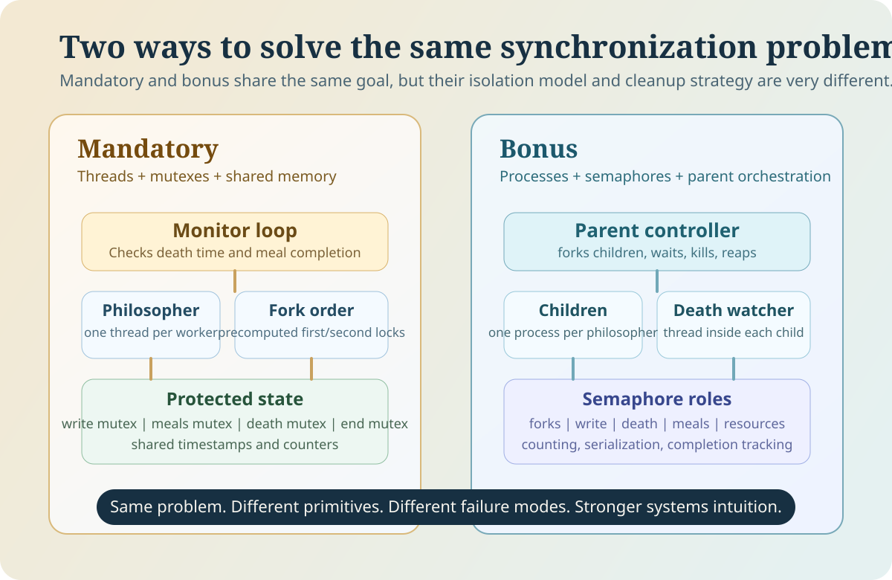
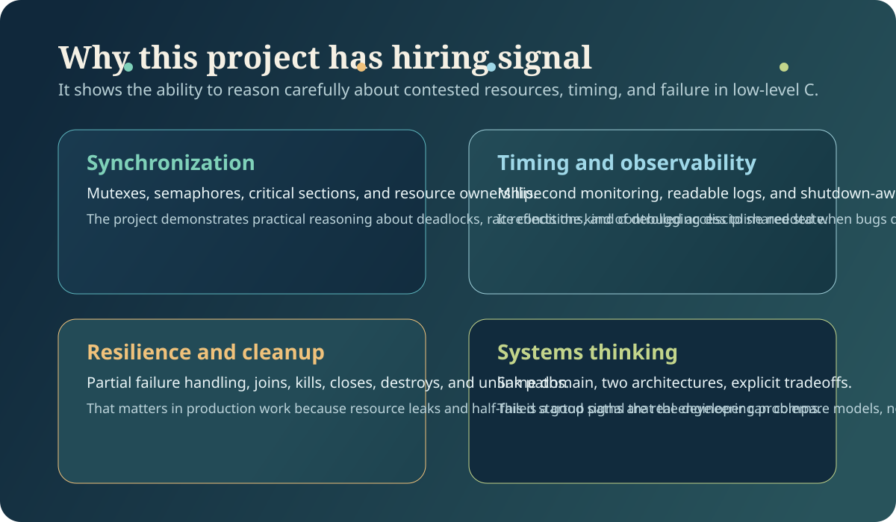

# Philosophers

<p align="center">
  
</p>

<p align="center">
  <strong>A 42 School concurrency project in C</strong><br />
  Two implementations of the dining philosophers problem:
  <code>threads + mutexes</code> and <code>processes + semaphores</code>.
</p>

<p align="center">
  This repository is less about printing philosopher states and more about proving that shared resources,
  timing constraints, and shutdown conditions can be handled cleanly under pressure.
</p>

## At a Glance

| Topic | What this project shows |
| --- | --- |
| Language | C |
| Core concepts | Concurrency, synchronization, deadlock avoidance, timing, cleanup |
| Mandatory part | POSIX threads + mutexes |
| Bonus part | Processes + named semaphores |
| Focus | Correctness first, then clarity, then performance-aware behavior |
| Deliverables | [`philo/`](./philo), [`philo_bonus/`](./philo_bonus) |

> The same problem is solved twice on purpose: once with shared-memory threads, and once with isolated processes. That contrast is where a lot of the academic and engineering value comes from.

## Why This Project Matters

The dining philosophers problem is a classic concurrency exercise because it looks simple on paper and becomes difficult the moment real timing, shared state, and resource contention enter the picture.

In practice, this project forced me to answer questions that show up in real systems work:

- How do you prevent deadlocks without destroying throughput?
- How do you detect failure quickly without turning the whole program into busy waiting?
- How do you keep logs readable when several execution contexts want to print at the same time?
- How do you shut everything down cleanly when one worker dies or when all workers finish?
- How do thread-based and process-based designs change the synchronization strategy?

## Visual Overview

<p align="center">
  
</p>

## What I Built

### Mandatory: `philo`

The mandatory version models each philosopher as a thread and each fork as a mutex.

- Every philosopher owns a `right` fork mutex and keeps a pointer to the neighbor's left fork.
- Fork acquisition order is precomputed with `first` and `second` pointers so the hot path does not have to keep deciding which fork to lock first.
- Odd and even philosophers do not acquire forks in the same order, which breaks the circular wait pattern that usually causes deadlock.
- A monitor loop checks each philosopher's last meal timestamp and ends the simulation as soon as a death is detected.
- Separate mutexes protect output, meal counters, death timestamps, and the global end flag.

Helpful entry points:

- [`philo/main.c`](./philo/main.c): argument parsing, startup, monitor, thread joins
- [`philo/init.c`](./philo/init.c): mutex creation, philosopher wiring, cleanup
- [`philo/philo.c`](./philo/philo.c): philosopher routine and action lifecycle
- [`philo/time.c`](./philo/time.c): millisecond clock and responsive sleep loop

### Bonus: `philo_bonus`

The bonus version solves the same problem with processes instead of threads.

- Each philosopher becomes a child process created with `fork()`.
- Fork availability is managed through a counting semaphore.
- Additional semaphores serialize writes, protect death-sensitive data, count completed meal targets, and stagger resource access.
- A parent-side controller waits for termination and cleans up the remaining children.
- Named semaphores are created with randomized names and unlinked immediately after opening, which avoids stale OS-level semaphore names between runs.

Helpful entry points:

- [`philo_bonus/main_bonus.c`](./philo_bonus/main_bonus.c): process creation and lifecycle control
- [`philo_bonus/init_bonus.c`](./philo_bonus/init_bonus.c): semaphore setup and cleanup
- [`philo_bonus/philo_bonus.c`](./philo_bonus/philo_bonus.c): philosopher process routine and death watcher
- [`philo_bonus/rand_bonus.c`](./philo_bonus/rand_bonus.c): overflow-safe parsing and semaphore name generation

## Build and Run

Build the mandatory target:

```bash
make -C philo
```

Run it:

```bash
./philo/philo number_of_philosophers time_to_die time_to_eat time_to_sleep [number_of_times_each_philosopher_must_eat]
```

Example:

```bash
./philo/philo 5 800 200 200 3
```

Build the bonus target:

```bash
make -C philo_bonus
```

Run it:

```bash
./philo_bonus/philo_bonus number_of_philosophers time_to_die time_to_eat time_to_sleep [number_of_times_each_philosopher_must_eat]
```

Example:

```bash
./philo_bonus/philo_bonus 5 800 200 200 3
```

### Parameter Reference

| Argument | Meaning |
| --- | --- |
| `number_of_philosophers` | Number of concurrent philosophers participating in the simulation |
| `time_to_die` | Maximum time in milliseconds a philosopher can go without eating |
| `time_to_eat` | Time in milliseconds spent eating |
| `time_to_sleep` | Time in milliseconds spent sleeping |
| `number_of_times_each_philosopher_must_eat` | Optional stop condition; simulation ends when everyone reaches this count |

## Example Output

Representative threaded run:

```text
0 1 has taken a fork
0 1 has taken a fork
0 1 is eating
0 3 has taken a fork
0 3 has taken a fork
0 3 is eating
200 1 is sleeping
200 2 has taken a fork
200 2 has taken a fork
200 2 is eating
```

Single philosopher edge case:

```text
0 1 has taken a fork
801 1 died
```

## Engineering Decisions That Matter

### Deadlock avoidance

The mandatory implementation assigns fork order once during initialization instead of improvising it inside the loop. That is a small design choice, but it keeps the runtime path simpler and helps avoid the classic "everyone grabs one fork and waits forever" failure mode.

### Responsive sleep instead of one blunt `usleep`

Both versions use a custom millisecond sleep loop. Rather than sleeping once for the whole duration, the code wakes up in short intervals, checks the elapsed time, and continues. This gives better control over timing-sensitive behavior and lets the mandatory version react faster to simulation shutdown.

### Separate synchronization domains

The code does not reuse one global lock for everything. Output, meal counts, death-sensitive state, and shutdown state are handled independently. That is useful for both correctness and maintainability because it makes the intent of each protected region clear.

### Cleanup as part of the design

This code pays attention to partial initialization failures and shutdown paths:

- mutexes are destroyed if setup fails partway through
- child processes are terminated and reaped in the bonus version
- named semaphores are closed and unlinked safely

In concurrency work, cleanup is not polish. It is part of correctness.

## What I Learned

This project taught me a lot more than how to use `pthread_mutex_lock()` or `sem_open()`.

- I learned to think in invariants, not just in control flow. The real question is not "what happens next?" but "what must never happen at the same time?"
- I learned that timing in concurrent programs is approximate, not magical. If a design depends on perfect scheduling, it is a fragile design.
- I learned to treat observability as an engineering feature. Clear logs are essential when multiple workers are racing.
- I learned that processes and threads solve similar problems with very different tradeoffs in memory sharing, cleanup complexity, and monitoring.
- I learned that edge cases like "one philosopher only" are not footnotes. They are often where the design reveals whether it is robust.

## Main Difficulties

These were the hardest parts of the project:

- Keeping the simulation accurate enough at millisecond scale while still running in normal user space.
- Avoiding deadlocks without over-serializing the whole program.
- Preventing log output from becoming unreadable when several workers act nearly simultaneously.
- Ending the simulation deterministically when a philosopher dies or when everyone has eaten enough.
- Cleaning up resources correctly in the process-based version, especially after partial failures or forced termination.

## Optimization Choices

This project is not about micro-benchmarks, but there are still meaningful optimization choices in the implementation:

- Fork ordering is computed once during setup instead of repeatedly inside the main loop.
- The mandatory version uses one monitor loop instead of giving every philosopher an extra monitoring thread.
- The bonus version separates fork counting from meal completion tracking so each semaphore has a single clear responsibility.
- Randomized semaphore names reduce collisions between runs and make the bonus version more robust in real shell environments.
- Short sleep intervals improve responsiveness around death detection and shutdown conditions.

## Academic Value

This project has strong academic value because it turns abstract operating-systems theory into something concrete and debuggable.

- It demonstrates mutual exclusion with real POSIX primitives.
- It makes deadlock, starvation risk, and liveness concerns visible instead of theoretical.
- It compares shared-memory concurrency against process isolation in the same domain.
- It reinforces disciplined C programming through explicit resource management and failure handling.
- It encourages reasoning about time, not just state.

In other words, it is a compact systems-programming lab disguised as a small simulation.

## Why Recruiters Usually Like Projects Like This

<p align="center">
  
</p>

This project is a strong signal because it demonstrates more than syntax knowledge:

- comfort with low-level C and POSIX APIs
- ability to reason about shared state and race conditions
- experience debugging timing-sensitive behavior
- awareness of cleanup, failure modes, and lifecycle management
- ability to compare two architectural models for the same problem
- clear separation between correctness concerns and performance concerns

A recruiter or hiring manager reading this repository should come away with the sense that this is someone who can work carefully around complexity instead of hoping concurrency problems disappear on their own.

## Repository Map

| Path | Purpose |
| --- | --- |
| [`philo/`](./philo) | Mandatory solution using threads and mutexes |
| [`philo_bonus/`](./philo_bonus) | Bonus solution using processes and semaphores |
| [`archive/`](./archive) | Archived snapshot kept for reference |

## If I Extended This Further

The next improvements I would explore are:

- an automated stress harness with multiple timing profiles
- sanitizer-driven and race-debugging workflows
- fairness metrics and per-philosopher statistics
- a small visualization layer for replaying execution traces

Those additions would push the project from a strong academic exercise toward a more complete systems-debugging showcase.
